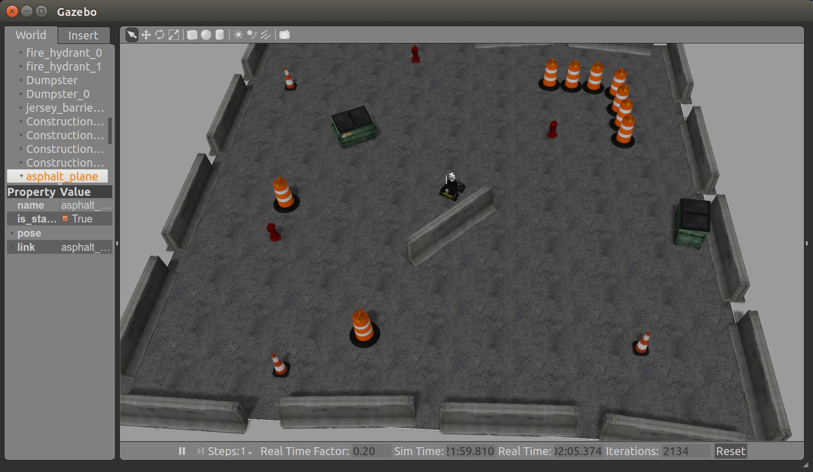

# 小任务
## JOB
* *部署*：依照部署指南在自己机器上部署[Husky项目](https://github.com/VccRobot/husky/tree/warmup)，
* *机器人移动控制* 在planpen地图(2d)中实现给定点的导航，例如：机器人初始位置为(0,0,0)，给定目标位置为(-1,-5,0)，用C++编写ROS程序控制机器人到达指定地点（忽略朝向）。附录有一些图片展示目标效果。
开发环境：Ubuntu 14.04, ROS版本：indigo

提示：下载好项目代码之后，先看一下ROS入门书前几章，理解一下项目结构，试着用python husky_ws/scripts/XXXX.py 或者roslaunch运行项目程序。
之后可以*查看ROS tf教程，仿照里面乌龟机器人的控制方法控制Husky机器人。*
如果直接这么做比较困难，可以试着自己编写运行*turtlesim*的例子

注：本项目诸多过程需要翻墙，请自行使用[proxychains+shadowsocks](https://echohn.github.io/2016/05/29/to-build-the-fullstack-tools-for-over-the-wall/)等工具翻墙。

-----------------------------------------------------------
## 参考文献

[项目代码](https://github.com/VccRobot/husky/tree/warmup)

[ROS入门书](http://lsi.vc.ehu.es/pablogn/investig/ROS/A Gentle Introduction to ROS.pdf)

[ROS入门实战例子turtlesim教程](http://wiki.ros.org/turtlesim/Tutorials)

[ROS编译工具catkin 文档](https://catkin-tools.readthedocs.io/)

[ROS tf教程](http://wiki.ros.org/tf/Tutorials)

[CMake基本例子](https://cmake.org/cmake-tutorial/) CMake是C++项目部署程序，而Catkin是基于CMake的，所以有可能需要了解CMake

[ETH自主机器人课程](https://www.edx.org/course/autonomous-mobile-robots)

注：catkin_make和catkin build都可以编译代码，catkin_make是旧版的编译命令。

-----------------------------------------------------------
### 其他参考文献
[LOAM SLAM算法论文](http://www.roboticsproceedings.org/rss10/p07.pdf)

[Cartographer 系统文档](https://google-cartographer.readthedocs.io/en/latest/)

[Cartographer ROS接口文档](https://google-cartographer-ros.readthedocs.io/en/latest/)

## 附录
自动导航到目标地点。

